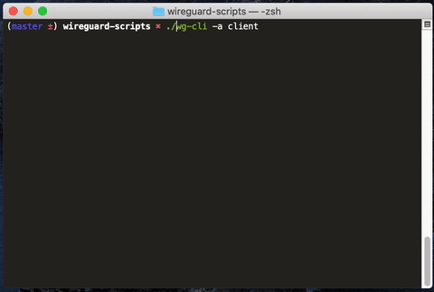

# Wireguard Cli

Wireguard CLI is an helper to handle the basic WireGuard configuration stuff.

- Create key pair (private and public keys)
- Create the server configuration.
- Create a new client.
- Add client to the server configuration.
- Share the client configuration via QRCode.

## Install WireGuard on your Server / Client

- [Official setup guide](https://www.wireguard.com/install/).
- Optional : qrencode (to share the client configuration).

## Configuration

To make this script fully automated, edit the `wg-cli` and change with your correct value

```conf
SERVER_ENDPOINT="YOUR_SERVER_EXTERNAL_IP:$SERVER_PORT"
SERVER_INTERFACE="enp0s3"
```

## Quick usage

Create a client and server initialize a new new server configuration (if absent).

```wg-cli -a client```

Show the QRCode client configuration :

```wg-cli -q client```



- Copy the configuration to your `/etc/wireguard` folder and then :

```sh
wg-quick up wg0
# If you want to update your current configuration
wg-quick down wg0
# and then
wg-quick up wg0
```

## Usage

```sh
Usage: wg-cli [-g [client-name]] | [-i] | [-a client-name] | [-c client-name] | [-h] | [-q client-name]

Arguments:
      -i                    Init the server configuration file.
      -g [client-name]      Generate a new key pair, if no « client-name » specified its generate the server key/pair.
      -c client-name        Create a new client.
      -a client-name        Add the requested client into the server configuration.
      -q client-name        Show the QRCode of the requested « client-name ». (require qrencode)
      -h                    Print help (this text) and exit.
```
